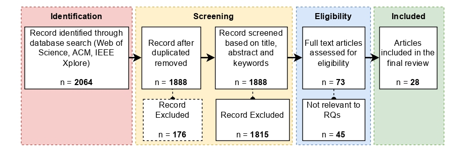

# sbrc-quantum-computing-uav
This repository is a companion compendium to the SBRC article on quantum computing for UAV collision avoidance, providing detailed explanations of the adopted methodology, assumptions, and implementation aspects that could not be fully explored in the paper.

# Systematic Review: Methodology
This systematic mapping study follows the **Preferred Reporting Items for Systematic Reviews and Meta-Analyses (PRISMA)** guidelines [1]. The objective is to characterize the state of the art on the use of quantum computing technologies to support collision avoidance in autonomous drones. The review adopts the **SPIDER framework** [2] to structure the analysis across heterogeneous study designs, focusing on how quantum principles contribute to UAV navigation and safety.

- **Sample:** Studies on UAVs employing quantum-based approaches for navigation or collision avoidance.
- **Phenomenon of Interest:** TThe application of quantum computing to collision avoidance in autonomous UAVs, considering perception, motion planning, and coordination tasks within a quantum–classical computational continuum.
- **Information Sources:** Peer-reviewed journal articles and conference papers in English indexed in IEEE Xplore, ACM and Web of Science.
- **Design:** Quantitative, qualitative, simulation-based, and theoretical studies addressing quantum-enhanced collision avoidance methods.
- **Evaluation:** Assessments linking quantum principles (e.g., superposition, entanglement, annealing) to avoidance performance and decision robustness.
- **Research Type:** Primary studies, including experimental, simulation-driven, and hybrid quantum--classical approaches.

The following research questions were used to identify such gaps:
- **RQ1:** What types of quantum-based approaches have been proposed to support collision avoidance in unmanned aerial vehicles?
- **RQ2:** How do the proposed quantum-based approaches relate to the high-level strategies adopted by studies to address collision avoidance in unmanned aerial vehicles (e.g., path planning, trajectory planning, obstacle avoidance, or infrastructure-related optimization)?

Figure 1 below provides an overview of the study selection process.

  

  <strong>Figure 1.</strong> PRISMA diagram illustrating the study selection process adopted in this systematic review.

The following links provide additional details that contribute to the reproducibility of this study:
- Selected databases and applied search strings: [Database Search Strategy](search-strategy.md)
- Inclusion and exclusion criteria and full-text stage articles: [Eligibility Criteria and Full-Text Assessment](eligibility-criteria-and-full-text-assessment.md)

# References
[1] M. J. Page *et al*., “The PRISMA 2020 statement: an updated guideline for reporting systematic reviews,” *BMJ*, vol. 372, n71, 2021.

[2] A. Cooke, D. Smith, and A. Booth, “Beyond PICO: The SPIDER Tool for Qualitative Evidence Synthesis,” *Qualitative Health Research*, vol. 22, no. 10, pp. 1435–1443, 2012.
